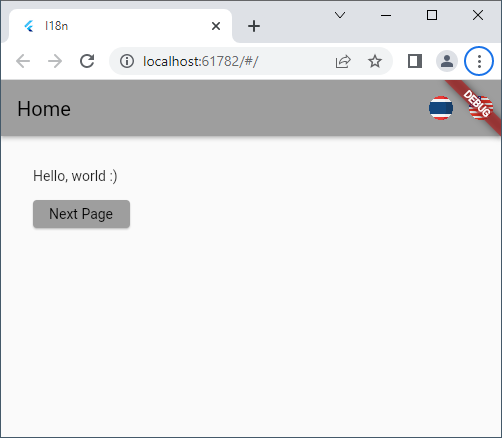

# Flutter: i18n

สวัสดีครับ วันนี้เราจะมาคุยเรื่อง Internationization (i18n) บน Flutter ครับ

จริงๆ Flutter เอง ก็มีเรื่อง i18n ให้ใช้อยู่แล้ว แต่พอใช้จริง ถ้าเป็น App ซัก 2-3 หน้า ก็ไม่มีปัญหา แต่พอมีหน้าเยอะๆ i18n ของ Flutter ก็ชักเยอะไปเหมือนกัน (ดูเรื่อง i18n ของ Flutter เพิ่มเติมครับ [ที่นี่](https://docs.flutter.dev/development/accessibility-and-localization/internationalization)) ผมเลยลองหา Library ตัวอื่นๆ ซึ่งก็เจอ [fast_i18n](https://pub.dev/packages/fast_i18n) (จริงๆ ลองหลายตัวแหละครับ แต่เจอตัวนี้เหมาะสุด เลยเอามาแชร์กัน)

fast_i18n จริงๆ การทำงาน ก็ใกล้เคียงกับทุกตัว คือ:
- สร้าง JSON หรืออาจเป็นไฟล์อื่น เช่น YAML, CSV เป็นภาษาต่างกัน เช่น en, th, etc...
- เขียน function เชื่อมต่อ ในตอนเริ่มโปรแกรม
- จากนั้นใช้ API ในการแปลภาษา (เช่น ใช้ t.appName แทน 'My App' เฉยๆ)

แต่ fast_i18n มีข้อดี (ในมุมของผม) คือมัน generate จาก .json เป็นไฟล์ .dart ซึ่งข้างใน เป็นตัวแปรธรรมดาๆ ซึ่งมีข้อดี:
- เวลาพิมพ์ มันสามารถเช็ค Syntax ได้ (t.appName) ต่างกับ (t['appNa**n**e']) ซึ่งมันจะเช็คการพิมพ์ผิดพลาดไม่ได้
- ตอนพิมพ์ ยังขึ้น IntelliSense ซึ่งสะดวกในการพิมพ์
- แต่ตอนที่ต้องการใช้แบบ t['appName'] ก็ยังทำได้อีกเช่นกัน
- การแปล มันมีความยืดหยุ่น เพราะสามารถใส่ตัวแปรได้ เช่น 'This is value: $value'

# ลองเขียน i18n App

สร้าง Project ขึ้นมาก่อน โดยที่เราจะมี 2 หน้า + หน้า Dialog อีกหนึ่ง เนื่องจากเป็น App ธรรมดาๆ ขอให้ดูใน git เลยครับ

	git clone https://github.com/taworn-ta7/articles.flutter.i18n.git
	git checkout before_i18n

ลองรันดูครับ จะได้ผลตามรูป 1-3

# เพิ่ม i18n

เราจะเพิ่ม feature i18n เข้าไป โดยแก้ไข pubspec.yaml ตรง dependencies, จาก:

	flutter:
	  sdk: flutter

เป็น

	flutter:
	  sdk: flutter
	flutter_localizations:
	  sdk: flutter
	  intl: ^0.17.0

จากนั้น เพิ่ม Library ใน dev_dependencies:

	build_runner: ^2.1.7
	fast_i18n: ^5.7.0

## เพิ่มไฟล์แปลภาษา

สร้าง Directory i18n ในระดับเดียวกันกับ main.dart ตามนี้ครับ

	+ test_i18n
	+ lib
		- main.dart
	+ i18n                     <= สร้าง directory ตรงนี้
		- strings.i18n.json    <= เพิ่มไฟล์ภาษา 'มาตรฐาน'
		- strings_th.i18n.json <= เพิ่มไฟล์ภาษาไทย

ไฟล์ strings.i18n.json ใน i18n:

	{
		"app": "I18n",
			"switchLocale": {
			"en": "Change Language to English",
			"th": "Change Language to ไทย"
		},
		"homePage": {
			"title": "Home",
			"text": "Hello, $where :)",
			"next": "Next Page"
		},
		"nextPage": {
			"title": "Next",
			"text": "Goodbye, $where :(",
			"next": "Alert"
		},
		"dialogBox": {
			"title": "Title",
			"text": "It is my life.",
			"ok": "OK"
		}
	}

ไฟล์ strings_th.i18n.json ใน i18n อีกไฟล์

	{
		"app": "เป็นสากล",
			"switchLocale": {
			"en": "Change Language to English",
			"th": "Change Language to ไทย"
		},
		"homePage": {
			"title": "หน้าแรก",
			"text": "อรุณสวัสดิ์, $where :)",
			"next": "Next Page"
		},
		"nextPage": {
			"title": "ต่อไป",
			"text": "ลาก่อน, $where :(",
			"next": "เตือน"
		},
		"dialogBox": {
			"title": "หัวข้อ",
			"text": "นี่คือชีวิตของฉัน",
			"ok": "ตกลง"
		}
	}

จากนั้นเปิด Menu View => Terminal ขึ้นมา พิมพ์:

	flutter pub run fast_i18n

บางที เครื่องคุณอาจมีปัญหา ให้เพิ่มเครื่องหมาย ? ไปที่

	final String? deviceLocale = WidgetsBinding.instance.window.locale.toLanguageTag();

เพิ่มเล็กน้อย กลายเป็น

	final String? deviceLocale = WidgetsBinding.instance?.window.locale.toLanguageTag();

Bug นี้ ผมไม่แน่ใจ เพราะปกติผมไม่เจอ เจอตอนเขียนบทความนี่แหละครับ Y_Y

## เพิ่มไฟล์ localization.dart

เป็น class Localization ที่:

- รายชื่อ en, th
- ภาษาที่ใช้ปัจจุบัน
- Singleton Pattern ที่ทำให้ เรียกใช้ได้จากทุกที่

Code ตามนี้ครับ

	import 'package:flutter/material.dart';
	import './i18n/strings.g.dart';

	/// Localization class.
	class Localization {
		static Localization? _instance;

		static Localization instance() {
			_instance ??= Localization();
			return _instance!;
		}

		// ----------------------------------------------------------------------

		/// Construction.
		Localization();

		/// Supported locale list.
		final list = const [
			Locale('en'),
			Locale('th'),
		];

		/// Current locale.
		Locale get current => list[_index];
		int _index = 0;

		/// Change current locale.
		void changeLocale(String locale) {
			late int i;
			switch (locale) {
				case 'th':
				i = 1;
				break;

				case 'en':
				case '':
				default:
				i = 0;
				break;
			}

			if (_index != i) {
				_index = i;
				LocaleSettings.setLocaleRaw(locale);
			}
		}

		/// Refresh current locale.
		void refreshLocale() {
			LocaleSettings.setLocaleRaw(current.languageCode);
		}
	}

## เพิ่มใน main.dart

ก่อนอื่นเพิ่มส่วน import

	import 'package:flutter/material.dart';
	import 'package:flutter_localizations/flutter_localizations.dart';
	import './i18n/strings.g.dart';
	import './localization.dart';
	import './home.dart';

จากนั้น ตรงส่วน main() เพิ่ม 3 บรรทัด

	WidgetsFlutterBinding.ensureInitialized();
	LocaleSettings.useDeviceLocale();
	LocaleSettings.setLocaleRaw(Localization.instance().current.languageCode);

ตรงส่วน Widget build(...) เพิ่มตรงนี้ครับ

	localizationsDelegates: const [
		GlobalMaterialLocalizations.delegate,
		GlobalWidgetsLocalizations.delegate,
		GlobalCupertinoLocalizations.delegate,
	],
	supportedLocales: Localization.instance().list,
	locale: Localization.instance().current,

## ไฟล์ home.dart

เพิ่มส่วน import

	import './i18n/strings.g.dart';
	import './localization.dart';

จากนั้นหารูปภาษาอังกฤษและไทย (ผมหาให้แล้วครับ อยู่ใน test_i18n/assets) อย่าลืม เพิ่มรายชื่อ asset ใน pubspec.yaml ด้วย ตามนี้ ตรงด้านล่างสุดครับ:

	assets:
	- assets/locales/en.png
	- assets/locales/th.png

จากนั้นเพิ่ม การกดปุ่ม:

	appBar: AppBar(
		title: Text(t.homePage.title),
		actions: [
			// Thai language
			IconButton(
				icon: Image.asset('assets/locales/th.png'),
				tooltip: t.switchLocale.th,
				onPressed: () => setState(
					() => Localization.instance().changeLocale('th'),
				),
			),

			// English language
			IconButton(
				icon: Image.asset('assets/locales/en.png'),
				tooltip: t.switchLocale.en,
				onPressed: () => setState(
					() => Localization.instance().changeLocale('en'),
				),
			),
		],
	),

เปลี่ยนจาก string ธรรมดาๆ ให้เป็นตัวแปรภาษา โดยปกติ ส่วนใหญ่จะใช้ตัวแปร t ครับ ดู Code ด้านบน ตรง t.homePage.title

แก้ไขส่วนที่เป็น string ธรรมดา ทั้งหมด

	...
	children: [
	Text(  t.homePage.text(where: 'world')  ),
	const Padding(padding: EdgeInsets.only(bottom: 16)),
	...

สังเกตุว่า เราใส่ตัวแปรในตัวแปลภาษาได้ แล้วค่อยมาใส่ค่าตัวแปรอีกที ดู code ด้านบนประกอบครับ

อีกจุดหนึ่ง เราใช้ string ข้างใน t[...] ได้อีก ตาม Code ครับ

	...
	child: Text(  t['homePage.next']  ),
	...

และสุดท้าย เพื่อให้เราเปลี่ยนภาษา เวลาอยู่ในหน้าถัดไป เพิ่ม:

	Navigator.push(
		context,
		MaterialPageRoute(builder: (context) => const NextPage()),
	).then(
		// ถ้ามีการเปลี่ยนภาษาในหน้าที่เปลี่ยนไป
		// เวลากลับมาอย่าลืม refresh ภาษาด้วย
		(value) => setState(
			() => Localization.instance().refreshLocale(),
		),
	);

## ไฟล์ next.dart

เพิ่มส่วน import เหมือนไฟล์ home.dart

	import './i18n/strings.g.dart';
	import './localization.dart';

และเหมือนเดิม ตรง AppBar

	appBar: AppBar(
		title: Text(t.nextPage.title),
		actions: [
			// Thai language
			IconButton(
				icon: Image.asset('assets/locales/th.png'),
				tooltip: t.switchLocale.th,
				onPressed: () => setState(
					() => Localization.instance().changeLocale('th'),
				),
			),

			// English language
			IconButton(
				icon: Image.asset('assets/locales/en.png'),
				tooltip: t.switchLocale.en,
				onPressed: () => setState(
					() => Localization.instance().changeLocale('en'),
				),
			),
		],
	),

สุดท้าย เปลี่ยนจาก string ธรรมดาๆ ให้เป็นตัวแปรภาษา t...

## ไฟล์ alert.dart

ไม่มีอะไรมากครับ แค่เปลี่ยนจาก string ธรรมดา ให้เป็นตัวแปรภาษา t... ครับ

# ทดลองรัน

จะได้ภาพตามรูปที่ 4-7

# Git และ Link

[Source in Git](https://github.com/taworn-ta7/articles.flutter.i18n.git)

ผม Download รูปจาก https://www.flaticon.com ครับ

